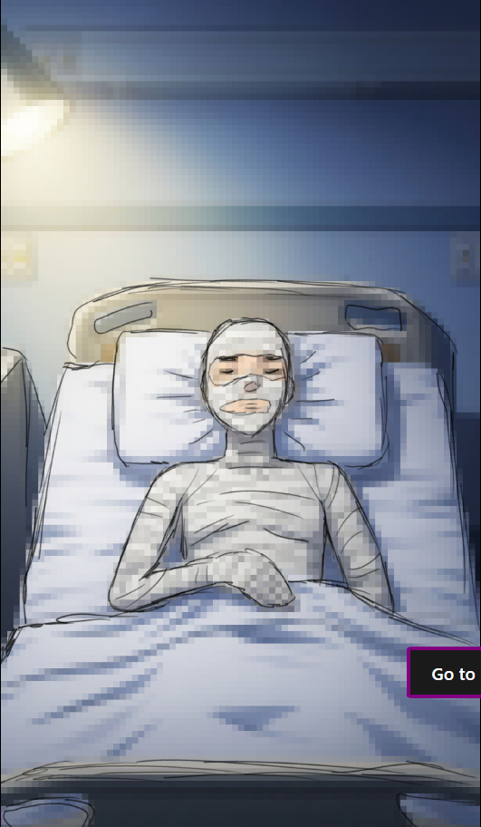
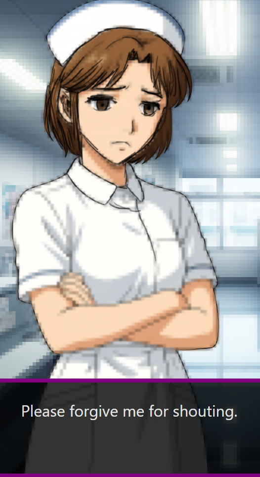
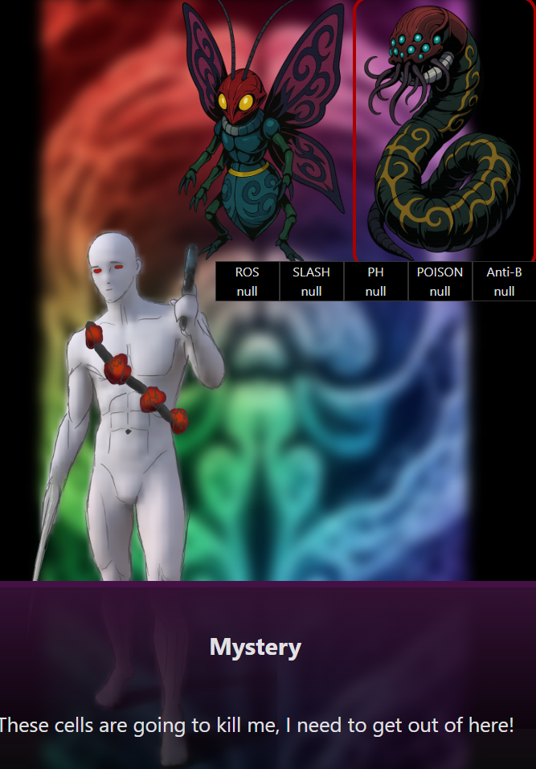
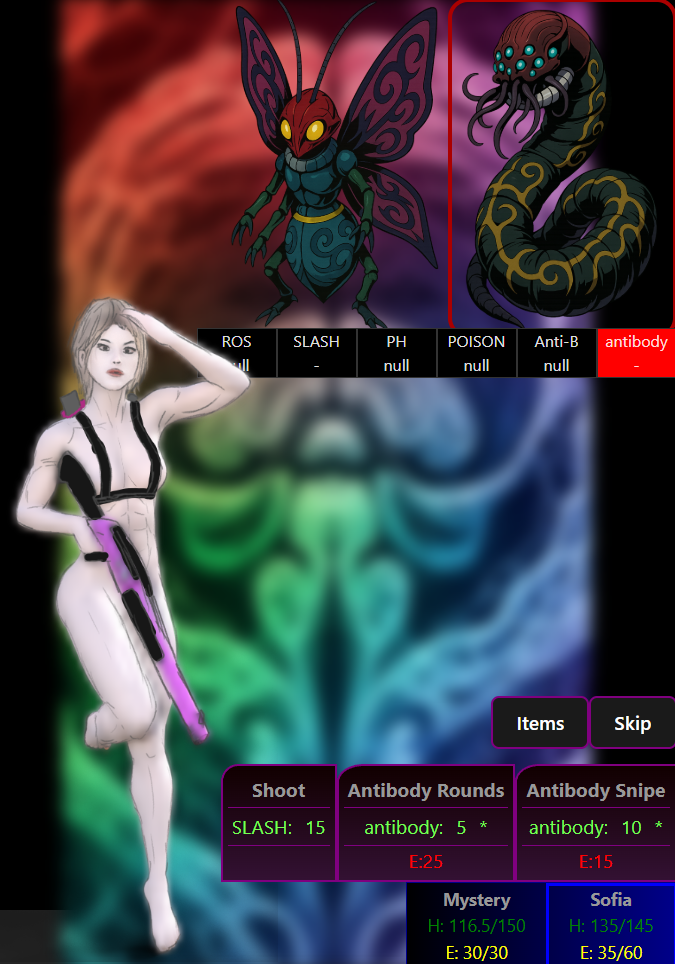

# Biona

Live Link: https://sbingley22.github.io/biona/

Description:
A persona like game for web browsers and android. You wake up in a hospital and quickly discover your illness gives you the power to enter another biological realm. You can use this power to interact with other patients on your ward suffering from various ailments. 
Enter their biological realm, learn about them, help them fight their respective diseases with the help of various human immune cells, and possibly cure them and even yourself?

Features:
- Short Visual Novel like story elements.
- Turn based battles featuring immune cells vs pathogens.
- Collect different friends, and immune cells with unique abilities, level up your knowledge of biology.
- Get to know the strange cast of Asiko Hospital as you come to terms with your new life there.

Todo:
- ~~Setup singlefile, pwa, gh-pages, zustand~~
- ~~Add hospital room and garden, and allow travel between them~~
- ~~Add json file for dialog events~~
- ~~Add advance day function which triggers any dialog~~
- ~~Characters and dialog appear on screen and clicking moves dialog on~~
- ~~Icons are hidden during dialog~~
- ~~Handle special actions during dialog~~
- ~~Location automatically changes back to bed room if no dialog is triggered on new day~~
- ~~Current day notification floats in and out from top right when days pass~~
- ~~Add character image on screen with dialog~~
- ~~Add go to bed button (end day)~~
- ~~Use dialog.json to add special text to certain characters on certain days that's different to social links.~~
- ~~Add placeholder images for bionas~~
- ~~Add weaknesses~~
- ~~Add battle ui (ability cards, health, opponent weaknesses, etc)~~
- ~~Temporarly add sofia to battle system~~
- ~~Add turns and attacks~~
- ~~Add ai turns~~
- ~~Seperate Arena into components etc~~
- ~~Add attack defend css animations~~
- ~~Add items and skip / defend turn~~
- ~~Allow attacks etc to inflict status effects.~~
- ~~make antibodies make attacks do increase damage~~
- ~~add status effects (poison reduces hp per turn, antibodies increase damage again)~~
- ~~clear status effects on match end~~
- ~~add outro battle dialog~~
- ~~add cure items functionality~~
- ~~add battle system~~
- ~~allow adding and removal of party members in battlemode~~
- ~~make player auto leave battle mode after first battle.~~
- ~~remove the install button~~
- ~~hold touch or right click to display action info~~
- ~~make arenas locked until previous complete~~
- ~~add save system with local storage.~~
- ~~make day end upon battle mode exit~~
- ~~add hp bar to enemies~~
- add day 14 events
- add social link json file that holds social link dialog and actions
- implement day routine behaviour (talking to characters, revising, earning money)
- implement a shop
- implement a leveling up system (unlock new attacks)
- make ui mobile friendly
